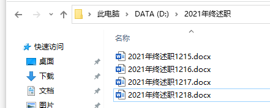
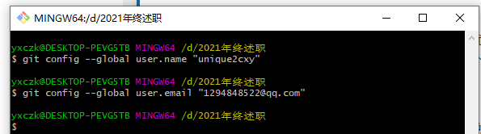
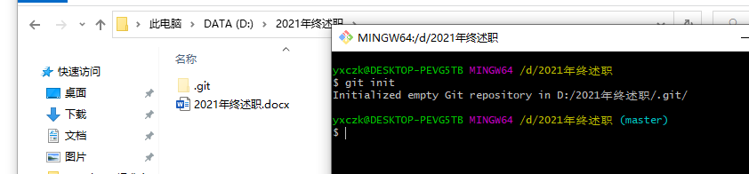
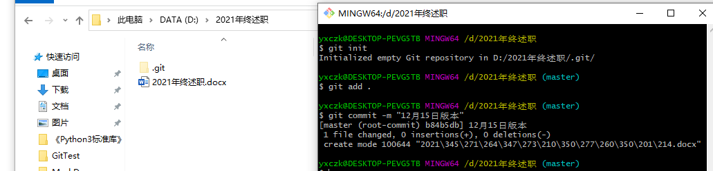
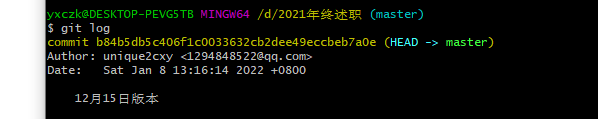
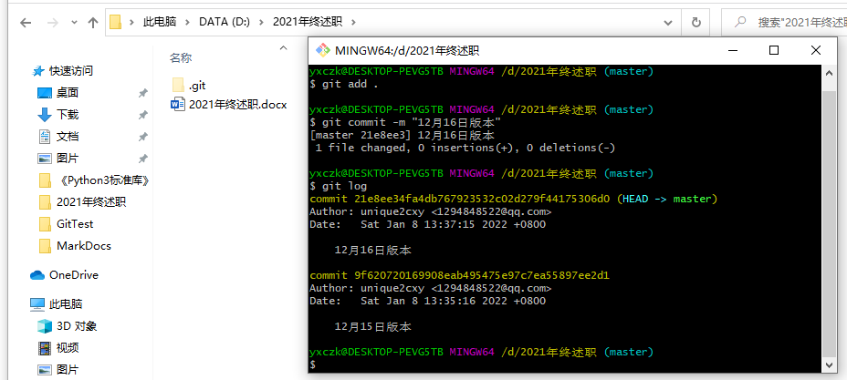
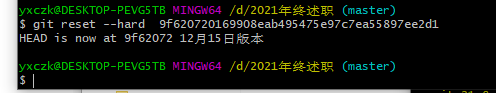
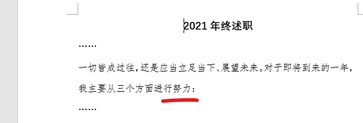

## Win10环境下Git的配置及使用

#### 1. 什么是Git

官方术语 **Git是一个版本控制系统（软件）** ，首先Git定位是一个工具，用它来管理内容的修改，下面我举个工作中常碰到的一个场景:

比如又到了年终述职时候了，你提前写好了初稿，保存在电脑本地文件夹中，接下来几天，你每天都进行了修改，为了保存前一天修稿过的版本，于是你每天都复制一个副本，然后进行修改，几天下来你的文件夹成了下面这样，但最终提交的也就其中一个文件。



上面的例子还好，也就几个文件，但如果有多个不同的文件，而且每个文件都这么 **复制副本式** 修改，时间久了整个文件夹会混乱不堪，这时候，你只要安装个Git，所有问题就都解决了。

#### 2. 安装Git

Win10安装软件不必说了，一路“下一步”即可，这里提供国内Git安装包网站：

+ Git官网：https://gitforwindows.org/
+ 国内镜像（这个下载速度快）：https://npm.taobao.org/mirrors/git-for-windows/ 

#### 3. 使用Git

+ **配置Git**

  安装完Git后，鼠标右键选择 **Git Bash Here**（或者开始菜单中找已安装的 **Git Bash**），依次输入下面两条命令，完成用户名和邮箱的设置（为了让Git知道每次是谁修改提交了内容，也可理解成用户登入）

  ```shell
  # 自己起个名字YourName，并填写自己的邮箱，一条输完回车再输第二条再回车
  git config --global user.name "YourName"
  git config --global user.email "******@qq.com"



+ **初始化仓库，让Git接管你的文件夹**

  进入到要使用的Git功能的文件夹，邮件选择选择 **Git Bash Here**，输入初始化指令，该文件会出现一个隐藏文件夹`.git`说明成功初始化，咱们先不管它（里面主要是配置文件以及每次备份的信息等等）

  ```shell
  git init
  ```

  

+ **开始备份**

  假如你写完了初稿，保存并关闭后，先指定Git要跟踪的文件

  ```shell
  # . 代表跟踪该文件夹下的所有文件，也可指定文件名，只跟踪指定文件
  git add .
  ```

  然后提交当前文件版本

  ```shell
  # 引号内给当前版本起个名字，便于今后查找
  git commit -m "12月15日版本"
  ```

  

+ **查看备份日志**

  输入如下命令，可以看到文件已经备份成功，里面还显示了作者和备份日期

  ```shell
  git log
  ```

  

+ 修改文件

  又过了一天，你准备修改初稿，此时你大可放心地直接对文件修改，而不必担心修改完不满意，觉得还是之前写的好，而无法复原。下面做个实验，体验下Git的妙处：

  

左边是已经备份好的文件内容，右边是在此基础上修改过的版本，保存关闭后，按照之前备份操作，备份当前修改过的版本

```shell
git add .
git commit -m "12月16日版本"
git log
```



从日志中，可看到当前和之前备份的记录。此时，你突然觉不满意当前修改的，想退回之前备份的版本，用下面命令进行恢复

```shell
# git log 命令可查看某个版本的“版本号”，即commit后的一大串
git reset --hard 版本号
```



于是我们打开文件，文件已经恢复到12月15日版本。




####  结语

整个文件夹内的备份工作全交给了Git接管，是不是很方便，尤其对于程序员开发大项目，如软件版本迭代等时候，Git显得尤为方便。本篇仅对Git功能入门的简单介绍，下次我们结合云仓库（如代码托管Github、Gitee等），介绍代码开发工具（如VsCode等）如何实现代码自动备份至云端。

我是unique2cxy，一个梦想成为程序员大咖的打工小白。

