# Git实现本地仓库与云端仓库（Github）间文件的备份和提取

之前的文章已经介绍了 ***Win10环境下Git的配置及使用*** ，里面结合了形象的例子介绍了为什么使用Git、怎么使用Git、使用Git的妙处等内容，感兴趣的同学点击以下链接查看：

CSDN：https://blog.csdn.net/cxy17017068/article/details/122380253?spm=1001.2014.3001.5501

知乎：https://zhuanlan.zhihu.com/p/454788175

### 1. 添加并关联云端库

+ 初始化本地仓库：首先我们要指定本地那个文件夹（路径）作为仓库，初始化本地仓库，让Git接管该文件夹，文件夹内右键点击`Git Bash Here`，输入以下命令

  ```shell
  git init
  ```

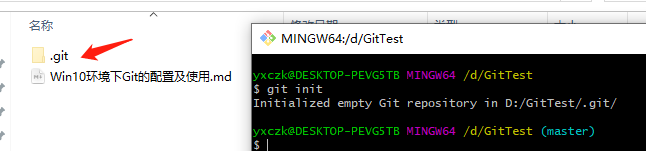

+ 本文以Github云端库为例进行介绍，首先注册Github账号并新建一个仓库，在仓库界面获取仓库地址

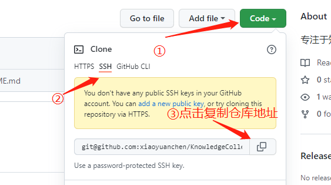

+ 本地添加云端Github仓库，git bash命令如下

  ```shell
  # 上一步中获得的GitHub仓库地址
  git remote add github git@github.com:xiaoyuanchen/KnowledgeCollection.git 
  
  # 查看已添加的云仓库
  git remote -v
  ```

  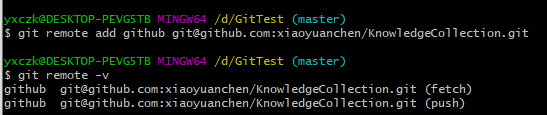

+ 本地Git仓库和云端Github仓库之间是通过SSH加密传输的，因此需要通过本地Git生成SSH Key，git bash输入以下命令，然后一直回车

  ```shell
  ssh-keygen -t rsa -C "GitHub上的邮箱"
  ```

  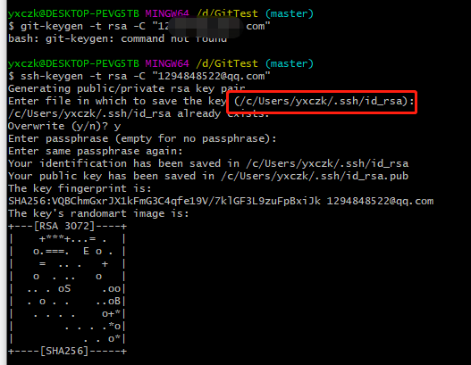

+ 成功后会在默认路径（如上图红框）下生成一个`id_rsa.pub`文件，复制里面的key，前往GitHub如下操作

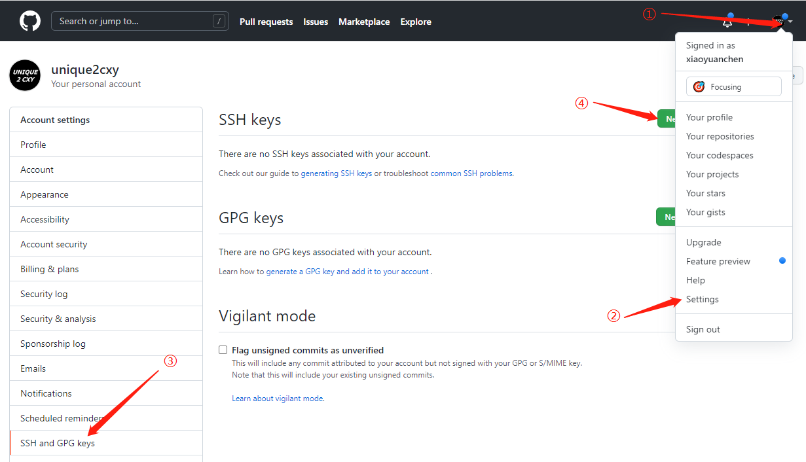

+ 将ssh key黏贴至Github中：

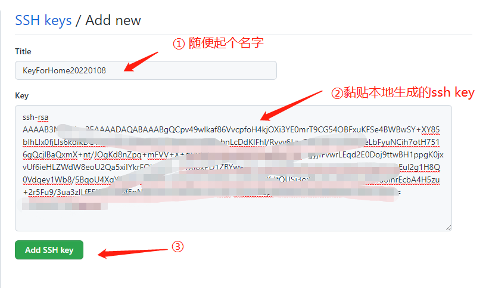

+ 成功后GitHub会显示刚刚添加的SSH Key，然后回到本地git bash 输入如下命令，验证是否成功

  ```shell
  ssh -T git@github.com
  ```

  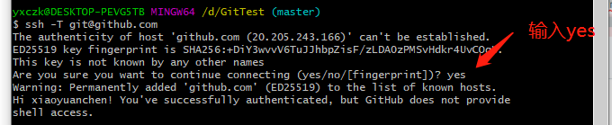

### 2. 同步本地文件至Github

+ 至此设置完毕，回到本地仓库，在Git Bash内依次添加待文件、提交并备注、提交至Github

  ```shell
  git add Win10环境下Git的配置及使用.md
  git commit -m "20220108第一版"
  git push -u github master
  ```

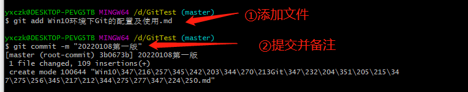

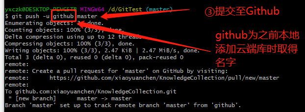

+ 至此文件以备份至Github，可以前去查看

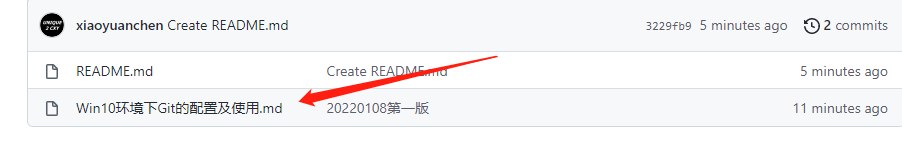

### 3. 提取云端仓库文件至本地仓库

上图中`README.md`文件是在Github上创建的，下面将其提取到本地仓库

```shell
# 本地更新修改
git fetch github

# 将更新同步至本地仓库
git merge github/master
```

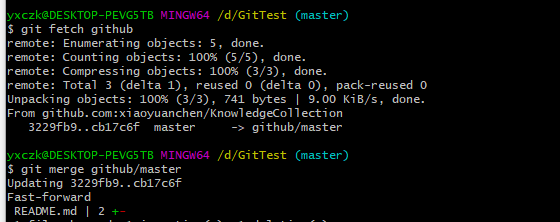

最后，本地就同步得到了`README.md`文件

我是unique2cxy，一个梦想成为程序员大咖的打工小白。

